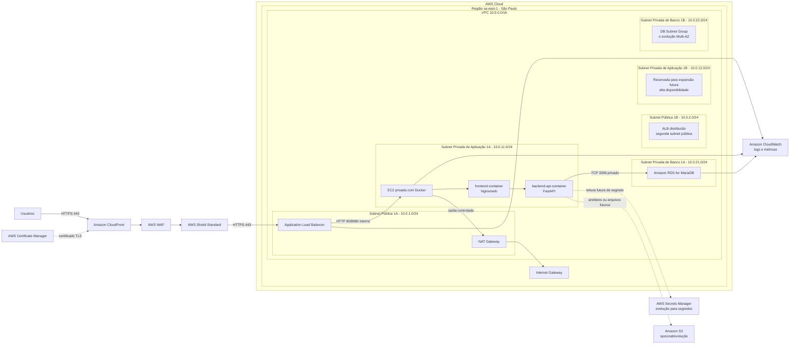
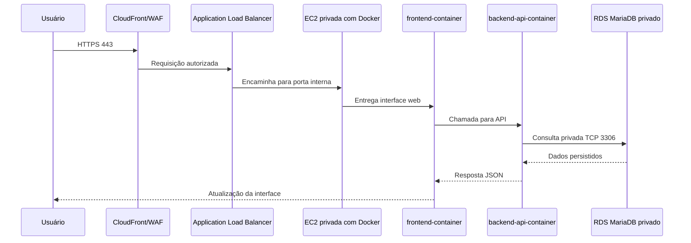
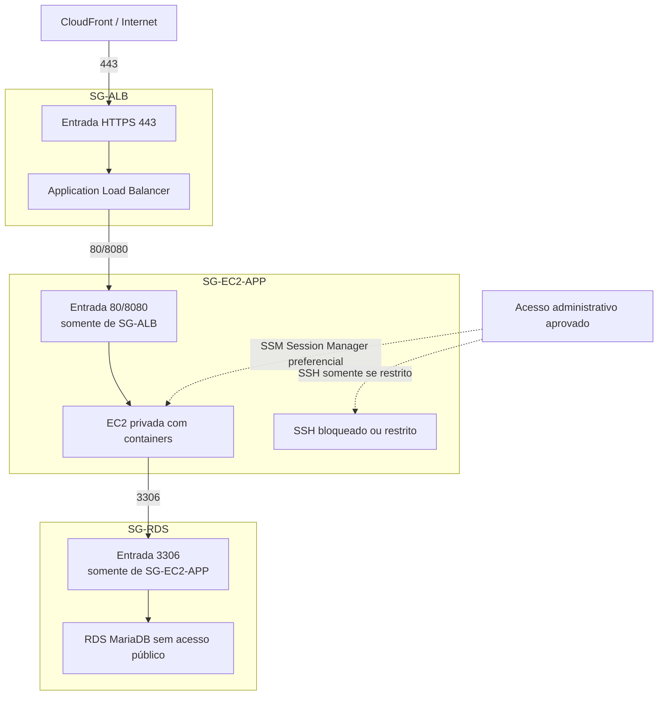

# Diagramas AWS de Referência

Os diagramas abaixo estão em Mermaid e refletem o diagrama visual "Mercantis Move2Cloud - Infraestrutura AWS do MVP". Eles são referência documental e não indicam que recursos reais foram criados.

## Diagrama 1 — Arquitetura AWS do MVP

## Diagrama 2 — Fluxo Principal

## Diagrama 3 — Security Groups

