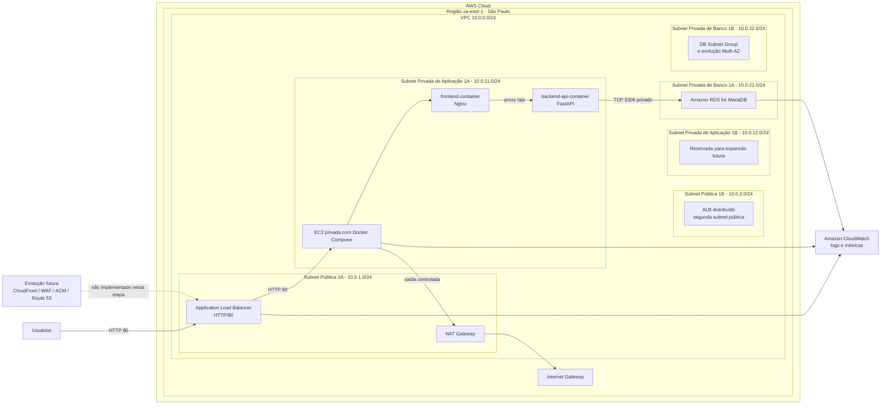
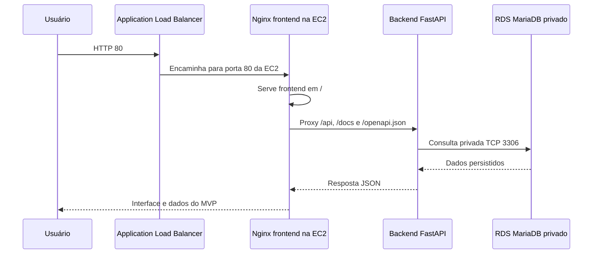
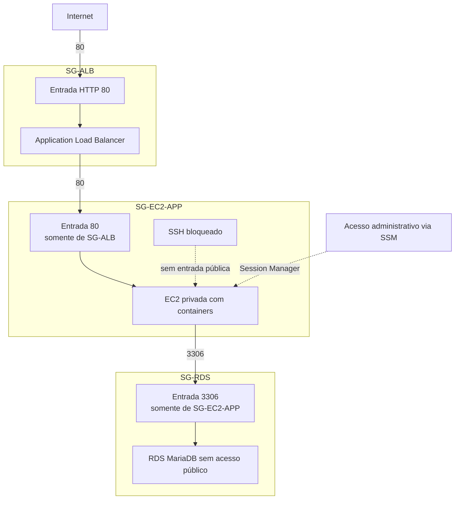

# Diagramas AWS do MVP

Os diagramas abaixo refletem o ambiente AWS de desenvolvimento do Mercantis Move2Cloud. O fluxo atual usa Application Load Balancer público em HTTP/80, EC2 privada com Docker Compose e Amazon RDS for MariaDB privado. CloudFront, WAF, ACM, Route 53, Auto Scaling e RDS Multi-AZ permanecem como evolução futura.

## Diagrama 1 - Arquitetura AWS Atual

## Diagrama 2 - Fluxo Principal

## Diagrama 3 - Security Groups

