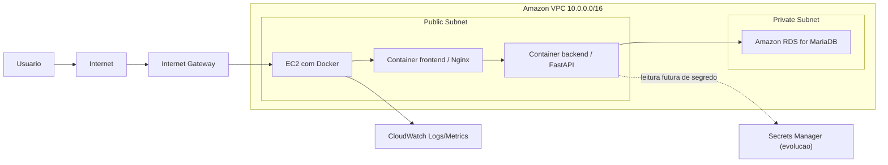
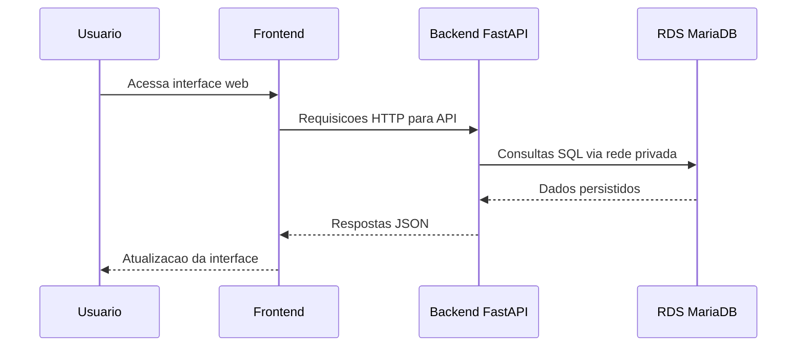
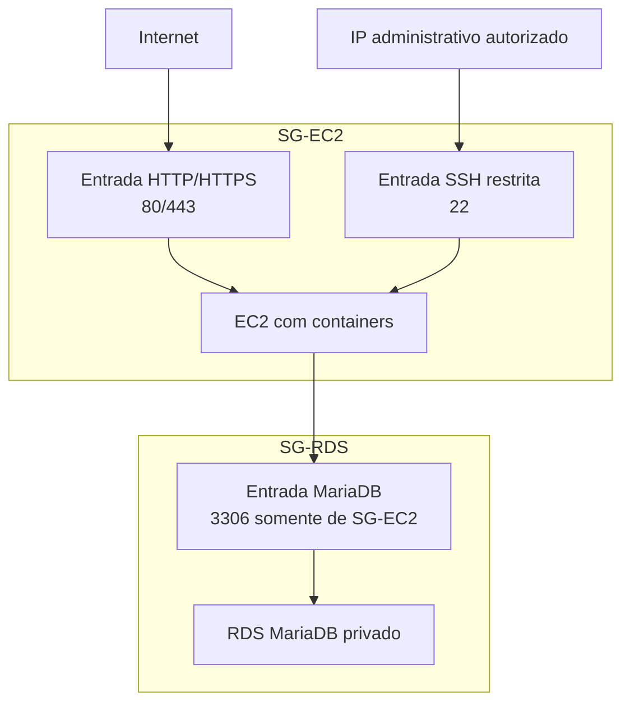

# Diagramas AWS de Referencia

Os diagramas abaixo estao em Mermaid e podem ser exportados para PNG ou SVG por ferramentas compativeis. Eles representam a arquitetura AWS de referencia e nao indicam que recursos reais foram criados.

## Arquitetura AWS de referencia

## Fluxo de comunicacao

## Security Groups

