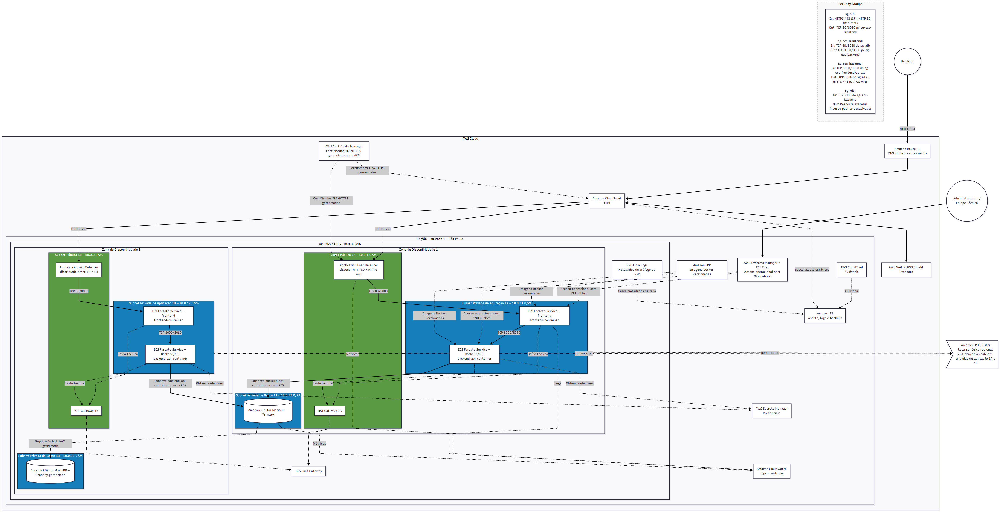

# Diagrama de Referência Final

A visão final desta etapa mantém a separação entre entrada pública controlada, aplicação privada e banco de dados privado. O ambiente AWS de desenvolvimento já usa ALB público em HTTP/80, EC2 privada com Docker Compose e RDS MariaDB privado.

## Componentes de referência

- VPC dedicada na região definida para o projeto.
- Subnets públicas para recursos de entrada controlada.
- Subnets privadas para aplicação.
- Subnets privadas para banco de dados.
- Backend acessando o banco pela porta 3306.
- Amazon RDS for MariaDB sem IP público.
- Observabilidade e auditoria com serviços AWS apropriados para logs e rastreabilidade.
- CloudFront, WAF, ACM, HTTPS, Route 53, Auto Scaling e RDS Multi-AZ como evolução futura.

## Fluxo alvo

```text
Usuário
-> Application Load Balancer público HTTP/80
-> EC2 privada com Docker Compose
-> backend FastAPI
-> Amazon RDS for MariaDB privado
```

Imagem de referência preservada no repositório:


