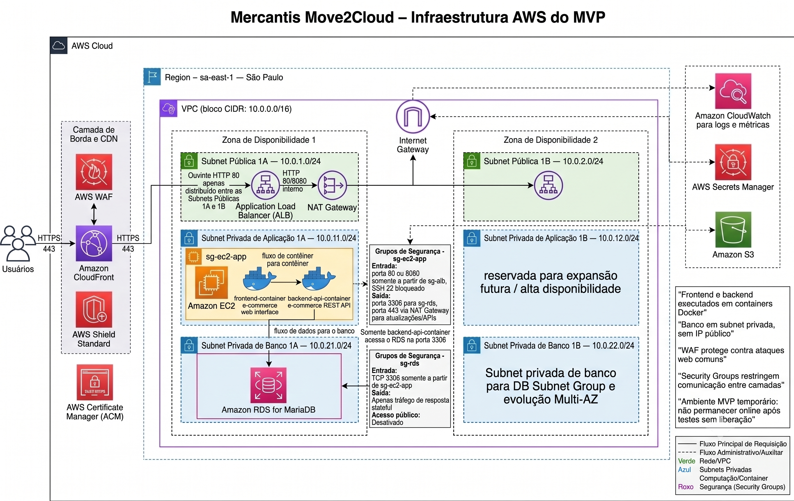

# Mercantis Move2Cloud — Documentação Técnica da Primeira Entrega

## 1. Resumo Executivo

A Mercantis é uma empresa de e-commerce cujo portal web representa a principal fonte de receita do negócio. O ambiente atual, mantido em infraestrutura on-premises, apresenta limitações relevantes de disponibilidade, segurança, desempenho e escalabilidade. A operação depende de recursos físicos sujeitos a falhas de energia, hardware e conectividade, com proteção limitada por no-breaks, firewall básico e ausência de mecanismos modernos de distribuição, inspeção de camada 7, redundância automatizada e observabilidade centralizada.

A migração para AWS é necessária para reduzir riscos operacionais, separar camadas críticas, eliminar exposição direta do banco de dados, melhorar a proteção de borda e preparar a evolução do portal para um modelo escalável. A solução proposta adota uma estratégia de **Replatform + Refactor parcial**: serviços gerenciados substituem componentes frágeis da infraestrutura original, enquanto frontend e backend são preparados para execução em containers Docker.

A primeira entrega não tem como objetivo operar uma loja virtual real em produção. O foco desta etapa é documentar a arquitetura, validar decisões técnicas, definir controles de segurança, estabelecer critérios de operação e planejar a evolução do MVP para uma arquitetura final TO-BE.

O **MVP** representa uma versão reduzida e temporária, executada em uma EC2 privada com Docker Compose, banco Amazon RDS for MariaDB em subnet privada, exposição controlada via CloudFront, AWS WAF e Application Load Balancer. A **arquitetura final TO-BE** evolui para Amazon ECS com AWS Fargate, Amazon ECR, Amazon RDS for MariaDB Multi-AZ, observabilidade e auditoria ampliadas, duas Zonas de Disponibilidade ativas e operação mais adequada para produção.

## 2. Contexto do Caso Mercantis

O portal de e-commerce da Mercantis é o principal canal de vendas e, por consequência, possui impacto direto na receita. No ambiente atual, a aplicação é executada com frontend Apache e banco MariaDB no mesmo segmento público, o que aumenta a superfície de ataque e dificulta a aplicação de controles de rede por camada.

A infraestrutura on-premises sofre com riscos de indisponibilidade causados por falhas físicas, quedas de energia, limitação de no-breaks, manutenção de hardware e ausência de failover automatizado. Além disso, o firewall existente oferece proteção básica, sem inspeção especializada para ameaças de camada 7, como SQL Injection, Cross-Site Scripting e padrões automatizados de ataques web.

Também há ausência de CDN/cache, o que faz com que todo o tráfego público seja atendido diretamente pelo ambiente de origem. Isso reduz a capacidade de absorver picos de acesso, aumenta a latência para usuários e concentra o risco operacional em poucos componentes. A falta de redundância, monitoramento centralizado, trilhas de auditoria e segregação entre camadas torna o ambiente inadequado para um e-commerce em crescimento.

## 3. Diagnóstico AS-IS — Ambiente Atual

| Categoria | Problema identificado | Risco técnico | Impacto no negócio | Solução proposta na AWS |
|---|---|---|---|---|
| Disponibilidade | Dependência de infraestrutura física local, energia e hardware próprios. | Falhas físicas podem interromper o portal sem failover automatizado. | Perda de vendas, indisponibilidade do canal principal e dano reputacional. | Uso de VPC em AWS, subnets distribuídas, ALB e evolução para ECS/Fargate e RDS Multi-AZ. |
| Segurança de borda | Firewall básico sem proteção especializada para aplicações web. | Ataques de camada 7 podem atingir diretamente a aplicação. | Risco de vazamento de dados, indisponibilidade e exploração de vulnerabilidades. | Amazon CloudFront, AWS WAF, AWS Shield Standard e TLS com AWS Certificate Manager. |
| Segmentação de rede | Frontend e banco no mesmo segmento público. | Movimento lateral e exposição indevida do banco de dados. | Aumento da superfície de ataque e risco de comprometimento de dados. | Subnets públicas, privadas de aplicação e privadas de banco, com Security Groups por camada. |
| Banco de dados | MariaDB exposto no mesmo contexto público da aplicação. | Acesso indevido, indisponibilidade e dificuldade de backup consistente. | Risco direto sobre dados transacionais e paralisação de vendas. | Amazon RDS for MariaDB em subnet privada, sem IP público e acessível apenas pelo backend. |
| Desempenho | Ausência de CDN/cache para conteúdo estático e tráfego público. | Origem sobrecarregada em picos de acesso. | Lentidão no portal e abandono de carrinho. | Amazon CloudFront e uso planejado de Amazon S3 para assets e artefatos. |
| Escalabilidade | Capacidade limitada por servidores físicos e configuração manual. | Crescimento de tráfego exige intervenção lenta e custosa. | Dificuldade de suportar campanhas, sazonalidade e aumento de clientes. | MVP em Docker Compose e evolução para ECS/Fargate com Auto Scaling. |
| Segurança física | Dependência de sala, energia, refrigeração e hardware locais. | Incidentes físicos afetam a continuidade do serviço. | Interrupções fora do controle da aplicação. | Execução em região AWS sa-east-1, reduzindo dependência do datacenter local. |
| Backup e recuperação | Estratégia local sujeita a falhas operacionais e físicas. | Recuperação lenta ou perda de dados. | Risco de perda de pedidos, clientes e histórico transacional. | Snapshots e backups automáticos do Amazon RDS, com RTO/RPO definidos. |
| Observabilidade | Logs, métricas e auditoria não centralizados. | Falhas e ataques podem não ser detectados em tempo adequado. | Maior tempo de diagnóstico e resposta a incidentes. | Amazon CloudWatch, AWS CloudTrail e VPC Flow Logs na arquitetura final. |

O ambiente atual não atende aos requisitos mínimos esperados para um e-commerce em crescimento, pois combina baixa resiliência, exposição excessiva de componentes críticos, pouca visibilidade operacional e dificuldade de escalar com segurança.

## 4. Estratégia de Migração

### 4.1 Rehost

Rehost consiste em mover servidores existentes para a nuvem com poucas alterações, normalmente preservando sistema operacional, aplicação, banco e modelo operacional. Essa abordagem pode acelerar uma migração inicial, mas tende a carregar fragilidades do ambiente original, como baixa segmentação, dependência de administração manual, exposição indevida e pouca modernização.

### 4.2 Replatform

Replatform mantém parte da lógica da aplicação, mas substitui componentes críticos por serviços gerenciados e recursos cloud-native. No caso da Mercantis, essa abordagem permite usar Amazon RDS for MariaDB para banco gerenciado, Amazon CloudFront para CDN, AWS WAF para proteção de aplicação web, Application Load Balancer para distribuição de tráfego, Amazon S3 para assets, logs e artefatos, Amazon CloudWatch para observabilidade e AWS Secrets Manager para credenciais.

### 4.3 Refactor

Refactor redesenha a aplicação para um modelo mais moderno, como containers, microsserviços ou serverless. Essa abordagem pode ampliar escalabilidade, isolamento e automação, mas também exige maior esforço técnico, testes e maturidade operacional.

### 4.4 Estratégia escolhida

A estratégia escolhida para o projeto é **Replatform + Refactor parcial**.

O Replatform é aplicado ao banco de dados, borda, balanceamento, armazenamento, observabilidade e gestão de segredos. O banco passa a ser Amazon RDS for MariaDB em subnet privada; a borda passa a utilizar CloudFront, AWS WAF, AWS Shield Standard e ACM; o tráfego é distribuído por ALB; logs e métricas são centralizados no CloudWatch; e credenciais deixam de ser tratadas como valores estáticos em arquivos ou servidores.

O Refactor parcial é aplicado ao empacotamento do frontend e do backend em containers Docker. No MVP, esses containers são executados em uma EC2 privada via Docker Compose. Na arquitetura final, a execução evolui para ECS/Fargate, com imagens versionadas no Amazon ECR.

Rehost puro não foi escolhido porque manteria fragilidades do ambiente original. Refactor completo também não é adequado para o MVP, pois adicionaria complexidade excessiva para uma primeira entrega acadêmica cujo objetivo é validar arquitetura, segurança e planejamento técnico.

## 5. Descrição Geral do Portal Web da Mercantis

### 5.1 Portal real esperado

O portal real de e-commerce da Mercantis deve oferecer uma experiência completa para clientes e operação comercial. Em um cenário de produção, espera-se catálogo completo de produtos, busca, filtros, cadastro completo de clientes, login, carrinho persistente, checkout, integração com meios de pagamento, integração logística, gestão de estoque, histórico de pedidos, painel administrativo, mecanismos antifraude e monitoramento de conversão.

Esse portal real também exigiria processos de operação contínua, tratamento de dados reais, controles formais de privacidade, integração com sistemas corporativos, gestão de incidentes, esteira de deploy, testes automatizados e monitoramento de indicadores de negócio.

### 5.2 Portal MVP

O MVP é uma versão reduzida do portal, criada para validar a arquitetura e a integração técnica. Ele deve representar um e-commerce simplificado com produtos fictícios, detalhe de produto, cadastro simples de usuário, login básico, carrinho, checkout simulado, persistência em MariaDB, API REST, frontend em container Docker e backend em container Docker.

O MVP não implementa pagamento real, integração logística, antifraude, nota fiscal, estoque real, painel administrativo completo ou dados reais de clientes. Ele também não deve permanecer online após testes sem liberação formal, pois seu objetivo é demonstração técnica e validação acadêmica.

| Funcionalidade | Portal real | MVP | Status na primeira entrega |
|---|---|---|---|
| Catálogo de produtos | Catálogo completo, categorizado e integrado ao estoque. | Lista de produtos fictícios. | Planejado como funcionalidade simplificada. |
| Busca e filtros | Busca textual, filtros por categoria, preço e atributos. | Pode ser limitado ou ausente. | Fora do escopo mínimo. |
| Cadastro de clientes | Cadastro completo com dados reais e validações. | Cadastro simples com dados fictícios. | Planejado para validação técnica. |
| Login | Autenticação robusta, recuperação de senha e políticas de segurança. | Login básico para fluxo de demonstração. | Planejado como fluxo mínimo. |
| Carrinho | Carrinho persistente, regras comerciais e cálculo de frete. | Carrinho simples persistido no banco. | Planejado como fluxo mínimo. |
| Checkout | Pagamento real, frete, antifraude e confirmação transacional. | Checkout simulado com criação de pedido. | Planejado sem pagamento real. |
| Pagamento | Integração com adquirentes ou gateways. | Não implementado. | Fora do escopo. |
| Logística | Integração com transportadoras e cálculo de entrega. | Não implementada. | Fora do escopo. |
| Estoque | Controle real de disponibilidade. | Produtos fictícios sem estoque real. | Fora do escopo. |
| Painel administrativo | Gestão operacional completa. | Não implementado ou apenas estrutura futura. | Fora do escopo. |
| API REST | Serviços completos para o portal. | Endpoints mínimos para produtos, usuários, carrinho e pedidos. | Planejado como validação de integração. |
| Persistência | Banco transacional de produção. | MariaDB com dados fictícios. | Planejado em Amazon RDS privado. |

## 6. Serviço Web Disponibilizado no MVP

O serviço web/API do MVP representa um e-commerce simplificado. O backend expõe endpoints REST para validar saúde da aplicação, listar produtos, consultar detalhe de produto, registrar usuários, autenticar, manipular carrinho, simular checkout e consultar pedidos.

A API é executada no `backend-api-container`, separada do `frontend-container`. O frontend consome a API por tráfego interno da aplicação. Apenas o backend acessa o Amazon RDS for MariaDB pela porta 3306; o frontend não acessa o banco diretamente.

| Método | Endpoint | Descrição | Autenticação necessária | Persistência no banco |
|---|---|---|---|---|
| GET | `/health` | Verifica disponibilidade básica da API. | Não | Não |
| GET | `/products` | Lista produtos fictícios disponíveis no MVP. | Não | Sim, leitura de `products` |
| GET | `/products/{id}` | Retorna detalhe de um produto fictício. | Não | Sim, leitura de `products` |
| POST | `/users/register` | Cria cadastro simples de usuário para demonstração. | Não | Sim, escrita em `users` |
| POST | `/auth/login` | Autentica usuário cadastrado no MVP. | Não | Sim, leitura de `users` |
| GET | `/cart` | Consulta carrinho do usuário autenticado. | Sim | Sim, leitura de `carts` e `cart_items` |
| POST | `/cart/items` | Adiciona item ao carrinho. | Sim | Sim, escrita em `cart_items` |
| DELETE | `/cart/items/{id}` | Remove item do carrinho. | Sim | Sim, alteração em `cart_items` |
| POST | `/orders/checkout` | Simula checkout e cria pedido. | Sim | Sim, escrita em `orders` e `order_items` |
| GET | `/orders/{id}` | Consulta pedido gerado no checkout simulado. | Sim | Sim, leitura de `orders` e `order_items` |

Fluxo funcional do MVP:

1. O usuário acessa o frontend pela camada pública protegida.
2. O frontend consulta a API do backend.
3. A API lista produtos fictícios.
4. O usuário se cadastra ou faz login.
5. O usuário adiciona produtos ao carrinho.
6. O backend persiste o carrinho no MariaDB.
7. O checkout simulado cria um pedido.
8. O pedido é salvo no banco para consulta posterior.

## 7. Modelo de Dados do MVP

O modelo de dados do MVP utiliza tabelas mínimas para representar usuários, produtos, carrinhos e pedidos. Todos os dados são fictícios e usados apenas para demonstração técnica.

| Tabela | Finalidade | Campos principais | Relacionamentos |
|---|---|---|---|
| `users` | Armazena usuários de demonstração. | `id`, `name`, `email`, `password_hash`, `created_at` | Um usuário pode possuir carrinhos e pedidos. |
| `products` | Armazena produtos fictícios do catálogo. | `id`, `name`, `description`, `price`, `image_url`, `active` | Produtos são referenciados por itens de carrinho e itens de pedido. |
| `carts` | Representa o carrinho ativo de um usuário. | `id`, `user_id`, `status`, `created_at`, `updated_at` | Pertence a `users` e possui vários `cart_items`. |
| `cart_items` | Registra produtos adicionados ao carrinho. | `id`, `cart_id`, `product_id`, `quantity`, `unit_price` | Pertence a `carts` e referencia `products`. |
| `orders` | Registra pedidos gerados no checkout simulado. | `id`, `user_id`, `status`, `total_amount`, `created_at` | Pertence a `users` e possui vários `order_items`. |
| `order_items` | Registra itens de um pedido. | `id`, `order_id`, `product_id`, `quantity`, `unit_price` | Pertence a `orders` e referencia `products`. |

Modelo conceitual resumido:

```text
users 1:N carts
carts 1:N cart_items
products 1:N cart_items
users 1:N orders
orders 1:N order_items
products 1:N order_items
```

## 8. Diagrama da Infraestrutura Final TO-BE


A arquitetura final TO-BE representa o estado-alvo para uma operação mais próxima de produção. Ela utiliza Amazon Route 53 para DNS público e roteamento, Amazon CloudFront como CDN, AWS WAF e AWS Shield Standard para proteção de borda, AWS Certificate Manager para certificados TLS/HTTPS, Application Load Balancer para distribuição de tráfego, VPC com subnets públicas e privadas, duas Zonas de Disponibilidade ativas, Amazon ECS Cluster, ECS Fargate Service para frontend, ECS Fargate Service para backend/API, Amazon ECR para imagens Docker, Amazon RDS for MariaDB Multi-AZ, Amazon S3 para assets, logs, backups e artefatos, AWS Secrets Manager, Amazon CloudWatch, AWS CloudTrail, VPC Flow Logs e AWS Systems Manager / ECS Exec para acesso operacional sem SSH público.

Fluxo principal de requisição:

```text
Usuários
→ Amazon Route 53
→ Amazon CloudFront
→ AWS WAF / AWS Shield Standard
→ Application Load Balancer
→ ECS Fargate Service — Frontend
→ ECS Fargate Service — Backend/API
→ Amazon RDS for MariaDB Multi-AZ
```

O conteúdo estático pode ser entregue por CloudFront com origem em Amazon S3, reduzindo carga nos containers. As imagens Docker são versionadas no Amazon ECR e consumidas pelos serviços ECS/Fargate. As credenciais do banco são obtidas pelo backend a partir do AWS Secrets Manager, evitando chaves ou senhas estáticas no código. Logs e métricas são enviados ao Amazon CloudWatch; eventos de auditoria são registrados no AWS CloudTrail; e metadados de tráfego da VPC são coletados por VPC Flow Logs.

Na arquitetura final, as duas Zonas de Disponibilidade participam ativamente da aplicação. O ALB é distribuído entre subnets públicas 1A e 1B; serviços ECS/Fargate executam frontend e backend nas subnets privadas de aplicação 1A e 1B; e o Amazon RDS for MariaDB opera com instância primária e standby gerenciado em Multi-AZ.

## 9. Diagrama da Infraestrutura do MVP



A arquitetura do MVP representa uma entrega reduzida, temporária e adequada para validação técnica. Ela contém CloudFront, AWS WAF, AWS Shield Standard, AWS Certificate Manager, Application Load Balancer, VPC, duas Zonas de Disponibilidade, subnets públicas, subnet privada de aplicação, EC2 privada executando Docker, `frontend-container`, `backend-api-container`, Amazon RDS for MariaDB em subnet privada, AWS Secrets Manager como padrão recomendado para credenciais do Amazon RDS, Amazon CloudWatch e Amazon S3 opcional para assets, backups, evidências e artefatos. O SSM Parameter Store pode ser usado para parâmetros não sensíveis ou configurações de menor criticidade.

No MVP, a aplicação roda em Docker Compose dentro de uma EC2 privada. Frontend e backend são containers separados. O banco não possui acesso público e fica em subnet privada. Os usuários não acessam diretamente a EC2, os containers ou o RDS; o acesso público é conduzido pela camada de borda e pelo ALB. O acesso ao banco ocorre somente pelo backend na porta 3306.

A segunda Zona de Disponibilidade aparece preparada para expansão futura e alta disponibilidade, com subnets públicas, privadas de aplicação e privadas de banco já planejadas. Entretanto, o MVP não deve ser descrito como ambiente de alta disponibilidade total. Ele é uma etapa intermediária para demonstração e validação da arquitetura, com possibilidade de evolução para o desenho final.

O ambiente MVP é temporário e não deve permanecer online após testes e demonstrações sem liberação formal. Custos de NAT Gateway, ALB, RDS, CloudFront, WAF e logs devem ser monitorados, e recursos não utilizados devem ser parados, removidos ou desassociados conforme o plano de descomissionamento.

## 10. Comparação entre MVP e Arquitetura Final

| Componente | MVP | Arquitetura Final TO-BE | Justificativa da evolução |
|---|---|---|---|
| Computação | EC2 privada executando Docker Compose. | ECS/Fargate em subnets privadas de aplicação. | Reduz administração de servidores e melhora escalabilidade operacional. |
| Frontend | `frontend-container` na EC2. | ECS Fargate Service — Frontend. | Permite escala independente e deploy mais controlado. |
| Backend | `backend-api-container` na EC2. | ECS Fargate Service — Backend/API. | Isola a API, melhora escalabilidade e separa responsabilidades. |
| Banco de dados | Amazon RDS for MariaDB privado em subnet de banco. | Amazon RDS for MariaDB Multi-AZ. | Aumenta resiliência e reduz risco de indisponibilidade do banco. |
| Alta disponibilidade | Parcial, com segunda AZ preparada para expansão. | Duas AZs ativas com ALB, ECS/Fargate e RDS Multi-AZ. | Transforma preparação arquitetural em operação resiliente. |
| Escalabilidade | Limitada à capacidade da EC2. | Auto Scaling dos serviços ECS/Fargate. | Permite responder a picos de tráfego com menor intervenção manual. |
| CDN | CloudFront na borda. | CloudFront integrado ao desenho final. | Mantém cache e redução de latência. |
| Segurança de borda | AWS WAF, AWS Shield Standard e ACM. | Mesmos controles, com operação permanente e regras amadurecidas. | Proteção consistente contra ataques web e DDoS básico. |
| Segredos | O padrão recomendado é AWS Secrets Manager para credenciais do Amazon RDS. O SSM Parameter Store pode ser usado para parâmetros não sensíveis ou configurações de menor criticidade. | AWS Secrets Manager integrado aos serviços ECS. | Padroniza rotação e consumo seguro de credenciais. |
| Observabilidade | Amazon CloudWatch para logs e métricas essenciais. | CloudWatch, CloudTrail e VPC Flow Logs. | Amplia diagnóstico, auditoria e visibilidade de rede. |
| Auditoria | Inicial e limitada. | AWS CloudTrail como controle formal. | Permite rastrear chamadas de API e mudanças de configuração. |
| Deploy | Atualização manual ou semiautomatizada na EC2. | Imagens no ECR e deploy em ECS/Fargate. | Melhora rastreabilidade, versionamento e rollback. |
| Custos | Menor complexidade, mas NAT Gateway, ALB e RDS ainda geram custo. | Custo maior, justificado por resiliência e operação. | MVP valida antes de investir no estado final. |
| Operação | Temporária, usada para testes e demonstração. | Operação contínua com controles formais. | Diferencia validação acadêmica de produção. |

## 11. Detalhes de Rede

A rede é planejada em uma VPC na região `sa-east-1 — São Paulo`, com bloco CIDR `10.0.0.0/16`.

Subnets sugeridas:

| Subnet | CIDR | Tipo | Uso previsto |
|---|---:|---|---|
| Subnet Pública 1A | `10.0.1.0/24` | Pública | ALB e NAT Gateway na Zona de Disponibilidade 1. |
| Subnet Pública 1B | `10.0.2.0/24` | Pública | ALB e NAT Gateway na Zona de Disponibilidade 2. |
| Subnet Privada de Aplicação 1A | `10.0.11.0/24` | Privada | EC2 no MVP ou ECS/Fargate na arquitetura final. |
| Subnet Privada de Aplicação 1B | `10.0.12.0/24` | Privada | Expansão do MVP e execução ECS/Fargate na arquitetura final. |
| Subnet Privada de Banco 1A | `10.0.21.0/24` | Privada | Amazon RDS for MariaDB primário ou instância do MVP. |
| Subnet Privada de Banco 1B | `10.0.22.0/24` | Privada | DB Subnet Group e standby gerenciado no Multi-AZ. |

As subnets públicas recebem recursos que precisam interagir com a internet, como Application Load Balancer e NAT Gateway. O tráfego público de entrada passa por CloudFront, AWS WAF, AWS Shield Standard e ALB. As subnets privadas de aplicação recebem a EC2 do MVP ou os serviços ECS/Fargate na arquitetura final. As subnets privadas de banco recebem o Amazon RDS, que não possui rota pública e não deve receber IP público.

O NAT Gateway é usado para saída técnica, como atualização de sistema, download de imagens, integração com APIs AWS e envio de logs, não para tráfego de entrada. Usuários externos não acessam diretamente a EC2 do MVP, os serviços ECS/Fargate da arquitetura final, os containers ou o RDS.

## 12. Security Groups do MVP

Os Security Groups do MVP devem restringir comunicação entre camadas e impedir acesso público direto à EC2 e ao RDS. As regras abaixo refletem a arquitetura do diagrama MVP.

| Security Group | Recurso associado | Direção | Protocolo | Porta | Origem/Destino | Justificativa |
|---|---|---|---|---:|---|---|
| `sg-alb` | Application Load Balancer | Entrada | TCP | 443 | CloudFront | Permite tráfego HTTPS público controlado pela borda. |
| `sg-alb` | Application Load Balancer | Entrada | TCP | 80 | CloudFront | Permitido apenas para redirecionamento HTTP para HTTPS. |
| `sg-alb` | Application Load Balancer | Saída | TCP | 80/8080 | `sg-ec2-app` | Encaminha requisições para a aplicação em container na EC2 privada. |
| `sg-ec2-app` | EC2 privada com Docker Compose | Entrada | TCP | 80/8080 | `sg-alb` | Garante que apenas o ALB acesse frontend/API expostos na instância. |
| `sg-ec2-app` | EC2 privada com Docker Compose | Entrada | TCP | 22 | Bloqueado | Impede SSH público e reduz superfície de ataque administrativa. |
| `sg-ec2-app` | EC2 privada com Docker Compose | Saída | TCP | 3306 | `sg-rds` | Permite que somente o backend acesse o MariaDB. |
| `sg-ec2-app` | EC2 privada com Docker Compose | Saída | TCP | 443 | Internet via NAT Gateway / APIs AWS | Permite atualizações, Docker pull, CloudWatch e acesso ao AWS Secrets Manager para credenciais do Amazon RDS; o SSM Parameter Store pode ser usado para parâmetros não sensíveis ou configurações de menor criticidade. |
| `sg-rds` | Amazon RDS for MariaDB | Entrada | TCP | 3306 | `sg-ec2-app` | Restringe acesso ao banco somente à camada de aplicação. |
| `sg-rds` | Amazon RDS for MariaDB | Saída | Stateful | Dinâmica | Resposta ao tráfego iniciado pela aplicação | Security Groups são stateful; não há necessidade de liberar tráfego público de saída. |
| `sg-rds` | Amazon RDS for MariaDB | Acesso público | N/A | N/A | Desativado | O banco deve permanecer privado, sem IP público e sem rota de internet. |

Regras e restrições obrigatórias:

- Usuários não acessam a EC2 diretamente.
- Usuários não acessam o RDS diretamente.
- O frontend não acessa o RDS diretamente.
- Somente o backend acessa o RDS pela porta 3306.
- SSH público não deve ser aberto.
- O RDS deve permanecer sem IP público.
- O tráfego HTTP na porta 80 deve existir apenas para redirecionamento para HTTPS.
- A saída da EC2 para a internet deve ocorrer por NAT Gateway para fins técnicos.

## 13. Security Groups da Arquitetura Final TO-BE

Na arquitetura final, os Security Groups separam ALB, frontend, backend e banco. A comunicação é controlada por origem lógica, não por IPs públicos fixos.

| Security Group | Recurso associado | Direção | Protocolo | Porta | Origem/Destino | Justificativa |
|---|---|---|---|---:|---|---|
| `sg-alb` | Application Load Balancer | Entrada | TCP | 443 | CloudFront | Recebe tráfego HTTPS vindo da camada de borda. |
| `sg-alb` | Application Load Balancer | Entrada | TCP | 80 | CloudFront | Usado apenas para redirect HTTPS. |
| `sg-alb` | Application Load Balancer | Saída | TCP | 80/8080 | `sg-ecs-frontend` | Encaminha tráfego para o serviço frontend. |
| `sg-ecs-frontend` | ECS Fargate Service — Frontend | Entrada | TCP | 80/8080 | `sg-alb` | Permite acesso somente a partir do ALB. |
| `sg-ecs-frontend` | ECS Fargate Service — Frontend | Saída | TCP | 8000/8080 | `sg-ecs-backend` | Permite chamadas internas do frontend para a API. |
| `sg-ecs-backend` | ECS Fargate Service — Backend/API | Entrada | TCP | 8000/8080 | `sg-ecs-frontend` ou `sg-alb` | Permite chamadas da camada frontend ou roteamento direto controlado pelo ALB, quando necessário. |
| `sg-ecs-backend` | ECS Fargate Service — Backend/API | Saída | TCP | 3306 | `sg-rds` | Permite acesso do backend ao MariaDB. |
| `sg-ecs-backend` | ECS Fargate Service — Backend/API | Saída | TCP | 443 | AWS APIs, Secrets Manager, ECR, S3 e CloudWatch | Permite obter segredos, baixar imagens, enviar logs e acessar serviços AWS. |
| `sg-rds` | Amazon RDS for MariaDB Multi-AZ | Entrada | TCP | 3306 | `sg-ecs-backend` | Garante que somente a API acesse o banco. |
| `sg-rds` | Amazon RDS for MariaDB Multi-AZ | Saída | Stateful | Dinâmica | Resposta ao tráfego iniciado pelo backend | Mantém o banco fechado a acessos externos. |
| `sg-rds` | Amazon RDS for MariaDB Multi-AZ | Acesso público | N/A | N/A | Desativado | O banco não deve ter IP público nem rota de internet. |

## 14. Controles de Segurança Implementados

### 14.1 AWS WAF

O AWS WAF protege a camada web contra ameaças comuns de aplicação. Ele deve ser associado à borda adequada da arquitetura e configurado com regras gerenciadas e regras específicas para mitigar SQL Injection, Cross-Site Scripting, bots básicos, padrões maliciosos de requisição e abuso por taxa de requisições. O rate limiting ajuda a reduzir tentativas automatizadas de força bruta, scraping e negação de serviço em nível de aplicação.

### 14.2 AWS Shield Standard

O AWS Shield Standard fornece proteção DDoS básica para serviços AWS compatíveis, atuando principalmente contra ataques nas camadas de rede e transporte. Ele complementa CloudFront e WAF, reduzindo a exposição da origem e contribuindo para maior resiliência da borda.

### 14.3 HTTPS/TLS com ACM

O AWS Certificate Manager gerencia certificados TLS/HTTPS. Todo tráfego público deve usar HTTPS obrigatório, com redirecionamento de HTTP para HTTPS. Certificados não devem ser gerenciados manualmente em instâncias EC2 ou containers quando houver integração com serviços gerenciados de borda e balanceamento.

### 14.4 Security Groups

Security Groups funcionam como firewall stateful por recurso. Eles devem permitir somente o tráfego necessário entre camadas: público para ALB, ALB para aplicação, frontend para backend quando aplicável e backend para RDS. A regra de banco deve aceitar a porta 3306 apenas da camada de backend.

### 14.5 IAM com privilégio mínimo

Roles de IAM devem ser associadas a EC2 ou tarefas ECS conforme a arquitetura. O princípio de privilégio mínimo deve evitar permissões amplas e chaves estáticas. A aplicação deve receber somente acesso aos recursos necessários, como leitura de segredos, envio de logs e leitura ou escrita em buckets específicos quando previsto.

### 14.6 AWS Secrets Manager e SSM Parameter Store

O padrão recomendado é AWS Secrets Manager para credenciais do Amazon RDS. O SSM Parameter Store pode ser usado para parâmetros não sensíveis ou configurações de menor criticidade. O backend deve obter as credenciais em tempo de execução por role IAM, evitando senhas em código, arquivos versionados ou variáveis expostas indevidamente.

### 14.7 RDS privado

O Amazon RDS for MariaDB deve permanecer em subnet privada, sem IP público e sem rota direta para a internet. O acesso ao banco deve ser restrito ao Security Group da camada de backend. Essa separação elimina a exposição direta do banco que existia no ambiente AS-IS.

### 14.8 Logs e auditoria

Amazon CloudWatch centraliza logs e métricas da aplicação e infraestrutura. AWS CloudTrail registra chamadas de API e alterações em recursos AWS. VPC Flow Logs, previsto na arquitetura final, registra metadados de tráfego de rede para apoio em diagnóstico, auditoria e investigação de incidentes.

### 14.9 S3 com bloqueio de acesso público

Amazon S3 pode armazenar assets, logs, backups, evidências e artefatos. Buckets devem manter S3 Block Public Access ativado, exceto quando houver desenho explícito e controlado para distribuição pública via CloudFront. Logs e backups não devem ser expostos publicamente.

## 15. SLOs e Critérios de Sucesso

| Requisito | SLO sugerido | Aplicação no MVP | Aplicação na arquitetura final |
|---|---|---|---|
| Disponibilidade | 99,9% mensal | Objetivo arquitetural para orientar desenho e testes, sem garantia operacional plena. | Meta operacional real com duas AZs ativas, ECS/Fargate e RDS Multi-AZ. |
| Latência | ≤ 300 ms p95 para página inicial/carrinho | Referência para testes controlados e demonstração. | Meta monitorada com CloudFront, ALB, ECS e métricas de aplicação. |
| RTO | ≤ 1 hora | Orienta plano de recuperação do MVP e snapshots. | Meta operacional com procedimentos documentados e recursos Multi-AZ. |
| RPO | ≤ 15 minutos | Referência para backup e retenção em ambiente de teste. | Meta apoiada por backups automáticos e estratégia de recuperação do RDS. |
| Segurança | 100% do tráfego público com TLS | Obrigatório para demonstração pública controlada. | Obrigatório para operação contínua. |

No MVP, os SLOs são objetivos arquiteturais e critérios de validação. Na arquitetura final, passam a ser metas operacionais reais, acompanhadas por monitoramento, alertas, processos de resposta e revisão periódica.

## 16. Plano de Operação do MVP

O ambiente MVP deve ser usado apenas para testes, validação técnica e demonstração acadêmica. Ele é temporário, não deve conter dados reais, não deve processar pagamento real e não deve permanecer exposto por períodos prolongados sem aprovação.

Regras operacionais principais:

- Usar somente dados fictícios.
- Não incluir pagamento real.
- Não integrar logística real.
- Não habilitar RDS público.
- Não abrir SSH público.
- Controlar acesso por Security Groups e, quando necessário, por AWS Systems Manager.
- Monitorar custos de EC2, RDS, ALB, NAT Gateway, WAF, CloudFront, S3 e CloudWatch Logs.
- Registrar evidências técnicas necessárias para a entrega.
- Encerrar, parar ou remover recursos após testes conforme checklist de descomissionamento.

## 17. Plano de Descomissionamento

O ambiente MVP não deve permanecer online sem liberação. Após testes ou demonstrações, os recursos devem ser revisados para evitar custo desnecessário e exposição indevida.

| Recurso | Ação após teste/demonstração | Observação |
|---|---|---|
| EC2 | Stop ou terminate. | Se houver necessidade de evidência, coletar logs antes. |
| RDS | Criar snapshot e stop/delete conforme necessidade. | Confirmar que não há dados reais. |
| ALB | Remover se não usado. | ALB ativo gera custo contínuo. |
| NAT Gateway | Remover para evitar custo. | NAT Gateway parado não existe; deve ser excluído quando desnecessário. |
| WAF | Remover ou desassociar se não usado. | Preservar regras somente se houver continuidade aprovada. |
| CloudFront | Desabilitar se não necessário. | Considerar tempo de propagação. |
| S3 | Manter apenas evidências necessárias com bloqueio público. | Remover artefatos temporários e validar S3 Block Public Access. |
| EIP | Liberar se não usada. | Elastic IP alocado e não associado pode gerar custo. |
| Security Groups | Revisar/remover regras. | Eliminar regras temporárias e impedir portas públicas indevidas. |
| CloudWatch Logs | Manter apenas pelo período necessário. | Aplicar retenção para controlar custo. |

## 18. Roadmap Futuro

### Fase 1 — MVP acadêmico

- EC2 com Docker Compose.
- RDS MariaDB privado.
- Application Load Balancer.
- CloudFront, AWS WAF e AWS Shield Standard.
- Documentação, validação técnica e evidências.

### Fase 2 — Produção inicial

- ECS/Fargate para frontend e backend.
- Amazon ECR para imagens Docker.
- RDS MariaDB Multi-AZ.
- CloudWatch avançado.
- AWS Secrets Manager como padrão para credenciais.

### Fase 3 — Segurança e observabilidade avançadas

- Amazon GuardDuty.
- AWS Security Hub.
- AWS Config.
- Amazon OpenSearch Service.
- AWS X-Ray.
- Dashboards executivos e técnicos.

### Fase 4 — Evolução da aplicação

- CI/CD.
- Testes automatizados.
- Cache com Amazon ElastiCache.
- Desacoplamento de assets no Amazon S3.
- Melhorias no catálogo, carrinho e checkout.

## 19. Checklist de Segurança “Dia 1”

- MFA ativado para usuários AWS.
- Root account sem access keys.
- HTTPS obrigatório.
- AWS WAF ativado.
- RDS sem acesso público.
- Security Groups revisados.
- Nenhuma porta 22 aberta para internet.
- Credenciais do Amazon RDS no AWS Secrets Manager; parâmetros não sensíveis podem usar SSM Parameter Store.
- AWS CloudTrail ativado.
- Amazon CloudWatch Logs ativado.
- VPC Flow Logs ativado na arquitetura final.
- S3 Block Public Access ativado.
- Backup automático do RDS habilitado.
- Plano de rollback documentado.
- Plano de descomissionamento definido.

## 20. Conclusão

A proposta Mercantis Move2Cloud corrige os principais problemas do ambiente AS-IS ao eliminar o banco público, separar camadas, adicionar WAF/CDN, melhorar disponibilidade, preparar escalabilidade, adotar banco gerenciado, ampliar observabilidade, reduzir risco operacional e criar um caminho evolutivo do MVP para produção.

O MVP valida a arquitetura com escopo controlado: frontend e backend em containers Docker, execução temporária em EC2 privada, banco MariaDB em Amazon RDS privado e acesso público protegido por CloudFront, AWS WAF, AWS Shield Standard, ACM e ALB. A arquitetura final TO-BE amplia esse desenho com ECS/Fargate, ECR, RDS Multi-AZ, CloudTrail, VPC Flow Logs e operação em duas Zonas de Disponibilidade ativas.

A primeira entrega, portanto, estabelece uma base técnica adequada para evolução segura do portal da Mercantis, sem tratar o MVP como produção permanente e sem expor componentes críticos diretamente à internet.
